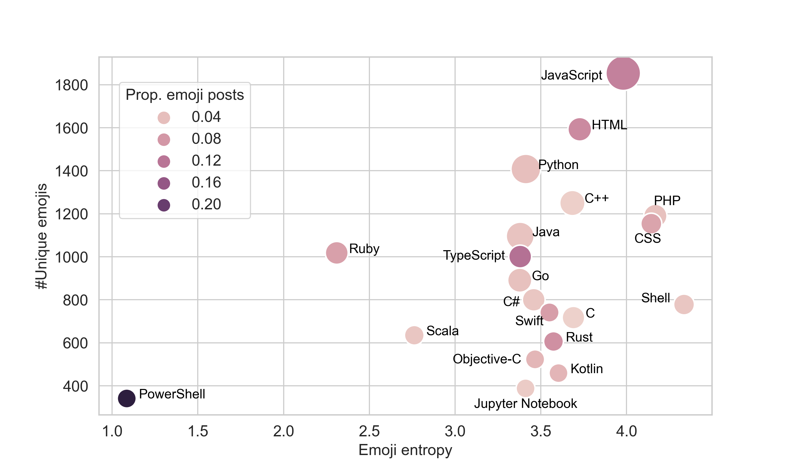

# SI699 Tutorial Project

[Slide deck](https://docs.google.com/presentation/d/1YiUaIcKpRbHQw0kBXYqOCc7F9aRvCc19_MkJoIRTO1Y/edit#slide=id.g2017ecfacf7_0_53)

## 1. Dataset

Original dataset from the [repo](https://github.com/luxuan09/emoji_predicts_dropouts/tree/master/data) of the paper

| Filename                               | Description                                           |
| -------------------------------------- | ----------------------------------------------------- |
| actor_emojis                           | Emoji count in 264808 posts                           |
| emoji_duplicate_mapping                | Map the duplicate emojis with different utf-8 code    |
| 2018_post_type_emojis                  | Emoji count in 6 kinds of posts                       |
| 2018_posttype_posts                    | Count of posts in 6 kinds of posts                    |
| 2018_posttype_emojiposts               | Count of posts with emojis in 6 kinds of posts        |
| 2018_repolang_posts                    | Count of posts in 324 languages                       |
| 2018_repolang_emojiposts               | Count of posts with emojis in 324 languages           |
| 2018_repolang_repos                    | Count of repos in 324 languages                       |
| 2018_repolang_emojis                   | Count of repos with emojis in 324 languages           |
| 2018_emoji_and_non_emoji_user_features | 529616 user info with 64 features                     |
| active\_(non\_)emoji_users             | two groups of 67664 users with emoji and dropout info |
| lang_emoji_dropout                     | dropout distribution among language                   |

## 2. Code Go-through

#### 2.1 Environment Setup

- Python version should be higher than 3.8.5

  ```sh
  pip install -r requirement.txt
  ```

#### 2.2 Descriptive Analysis

1. **Popularity Analysis**

   - There are 2699 emojis and the most popular 20 are 🚀 ✅ ⬆️ ☁️ 👍 ⬇️ 🎉 🌴 🎫 ✔️ ⚠️ ❌ ⌨️ 🚨 😄 ♻️ 📺 💛 ❤️ 🔥

   - The popularity among 6 post types

     | Post type            | Emojis              | Post with emoji count | Post with emoji count Percentage |
     | -------------------- | ------------------- | --------------------- | -------------------------------- |
     | Issues_comments      | 👍 ⌨️ 😄 🎉 🚀 💪 😉 🚨 📺 ✨ | 9436402               | 0.033                            |
     | Issues               | 🚨 📺 ❌ ⚠️ ✔️ 🌴 👋 ✅ ⌨️ 👽 | 18485203              | 0.034                            |
     | Pull_reivew_comments | 👍 😄 🤔 😉 ⚠️ 😅 🙂 😆 ✅ 💯 | 8366087               | 0.029                            |
     | Pull                 | ☁️ 🎫 🚀 🌴 🎉 🚦 ♻️ 📅 🔕 🎟️ | 802005                | 0.041                            |
     | Pull_comments        | ⬆️ 🚀 ✅ ⬇️ 👍 🎉 ✔️ ❌ ⚠️ 💛 | 11898784              | 0.14                             |
     | Commit comments      | ✅ 📜 👍 🔥 💯 😄 🦍 🎉 🔴 ®️ | 13863740              | 0.06                             |


2. **Emoji usage by programming languages**

   - The top 20 programming languages with emoji count and entropy are 
   
     | Programming Language | Emoji Count | Emoji Entropy |
     | -------------------- | ----------- | ------------- |
     | JavaScript           | 1854        | 3.98          |
     | Python               | 1408        | 3.41          |
     | Java                 | 1096        | 3.38          |
     | C++                  | 1250        | 3.68          |
     | Go                   | 891         | 3.38          |
     | HTML                 | 1593        | 3.73          |
     | PHP                  | 1190        | 4.17          |
     | Ruby                 | 1018        | 2.31          |
     | TypeScript           | 1001        | 3.38          |
     | C#                   | 800         | 3.46          |
     | C                    | 717         | 3.69          |
     | CSS                  | 1154        | 4.14          |
     | Shell                | 778         | 4.34          |
     | Rust                 | 606         | 3.57          |
     | Scala                | 635         | 2.76          |
     | Swift                | 741         | 3.55          |
     | Objective-C          | 523         | 3.47          |
     | PowerShell           | 341         | 1.09          |
     | Jupyter Notebook     | 388         | 3.41          |
     | Kotlin               | 459         | 3.6           |

#### 2.3 Feature Analysis

- Emoji usage varies in repositories that have different primary programming languages


  

   - One should control for programming languages when analyzing the relation of emoji usage and work-related status and outcomes.

 - Working status measurement
  
     | Categories | Working Status |
     | -------------------- | ----------- |
     | D1           | Activity level        |
     | D2              | Trend of activities        |
     | D3                | Type of activities        |
     | D4                 |  Type of posts        |
     | D5                  | Time management         |

1. **Feature selection**
   - Use log and percentage method to create 64 features of users
   - Use Variance Inflation Factor(VIF) method to remove correlated features (VIF > 5), and only leaves 45 features in total to ensure explainability of the model

2. **Regression Analysis**
   - OLS Regression for Emoji Usage on working status: 
     - #Emoji Posts
     - prop. Emoji Posts
     - prop. Emotional Emoji
       - LIWC emoji score (positive, negative, anger, anxiety, sadness)
  
3. **Label Analysis**
   - Why use dropout rate as feature

#### 2.4 Prediction

1. **Preprocessing**
   - Partition data by different measures including working hours and working days
   - In different measures, partition again by the top k% activate workers
   - Create 30 folds with in each partition for training and get in-sample metrics
   - Use min-max scaler to normalize the features
2. **Model Training**
   - Train 4 different models including SVM, Logistic Regression, Gradient Boost Tree, and Multiple Layer Neuron Network
   - Use 0.8-0.2 split to classify the training and testing data
   - Use 5-fold cross validation to find out the best parameter within each type of model (neglected in our notebook due to the time limit)
3. **Evaluation**
   - Record the accuracy, area under curve and the output of decision function of each model with in each partition
   - When measured by working hours, the accuracy and area under curve decrease as the users getting less active
   - When measured by working days, different models has different accuracy and area under curve for the most active users, and then they converge and increase together as the users getting less active

#### 2.5 Interpretation

1. **Feature Importance and Coefficient**
   - We're interested in the most active users measured by working hours.
   - Feature importance are measured by the params of gradient boost tree and use their coefficient in the logistic regression model
2. **Feature Predictivity**
   - Proportion of posts with emojis, number of emojis, and the number of posts with emojis, and the positive emotion are positively related to dropout rate
   - The number of days using emojis, the entropy of emojis, and the number of unique emojis are negatively related to dropout rate 
3. **Single Feature Analysis**
   - The more posts with emojis a worker has, the lower dropout rate
   - If the proportion of posts with emojis is high, it may imply obsession and lead to a high dropout rate
   - If the user is using emojis more diversely, he or she may dropout with a lower chance
   - If the emojis have a higher anger score, then the user will be more likely to dropout 
4. **Language Effect**
   - Within different language, the predictivity of user's usage of emojis are different. PowerShell is an outlier as it already is an outlier in emoji usage analysis
   - Users prefers to using emojis are less likely to dropout, and probability difference is consistent in most languages


